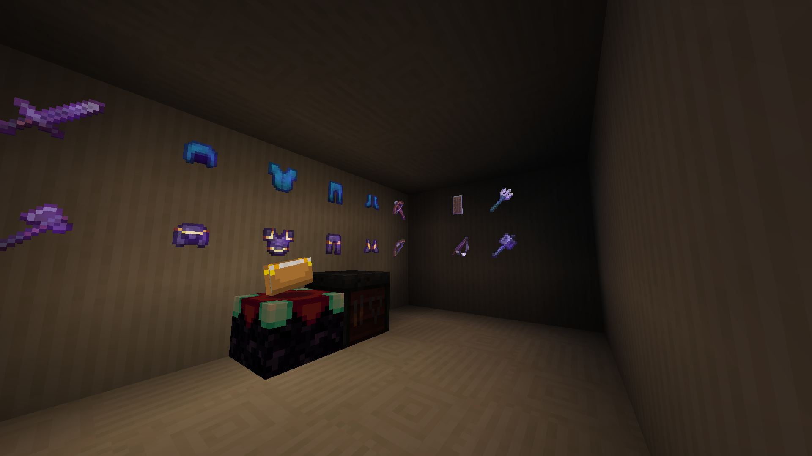
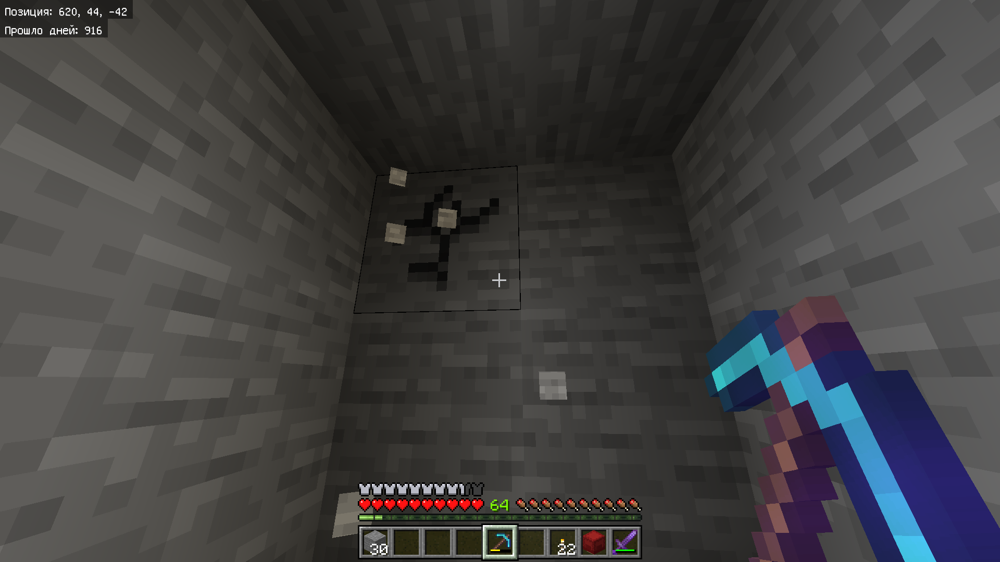

# Sleek Glow
A Minecraft Bedrock resource pack that replaces the default pixelated enchantment glint with a better smooth one similar to Java Edition.
Was Java Enchantment Glint previously.

## Config
There are 6 modes avaliable:
- **Updates Textures**
  - 256x Jappa Textures (for high-end devices)
  - 128x Jappa Textures (for medium devices)
  - 64x Jappa Textures (for low-end devices)
- **Classic Textures**
  - 256x Programmer Art Textures (for high-end devices)
  - 128x Programmer Art Textures (for medium devices)
  - 64x Programmer Art Textures (for low-end devices)

## Screenshots

An example of enchanted items with Slick Glow on

A player's first person view with Shield and Iron Sword being held

A player's first person view with Shield and Iron Sword being held

## Contacts
- [Telegram](https://t.me/Slucket) 
- [X (Twitter)](https://x.com/Sluck_et)
